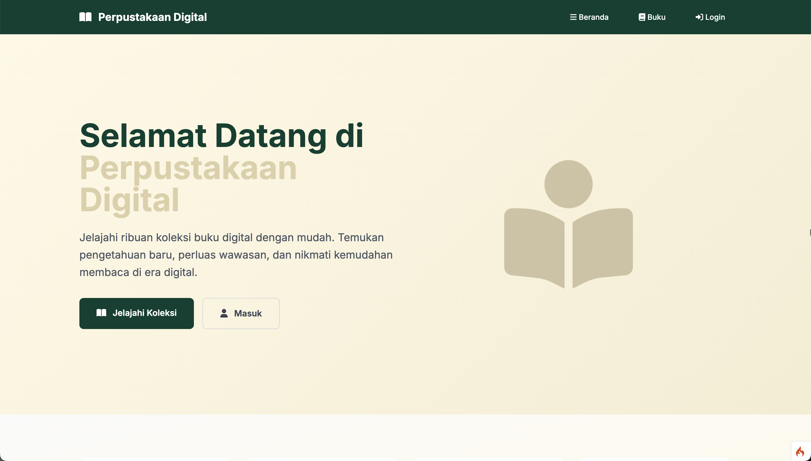
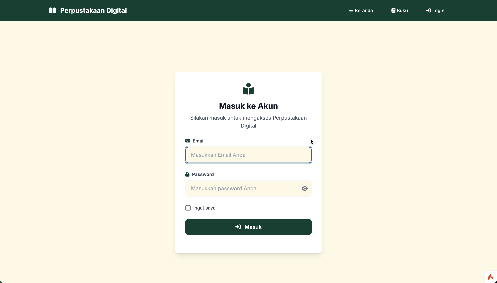
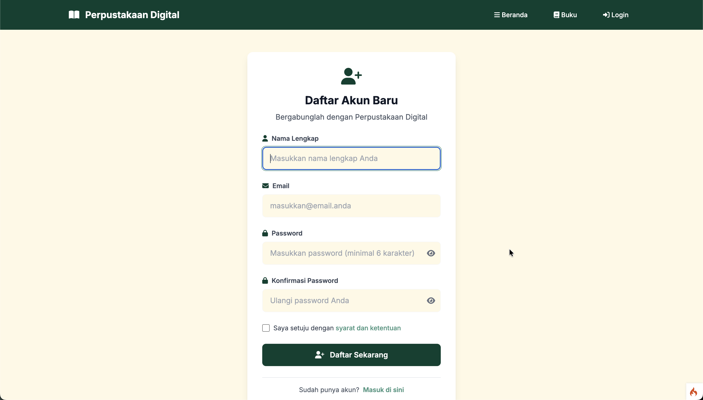
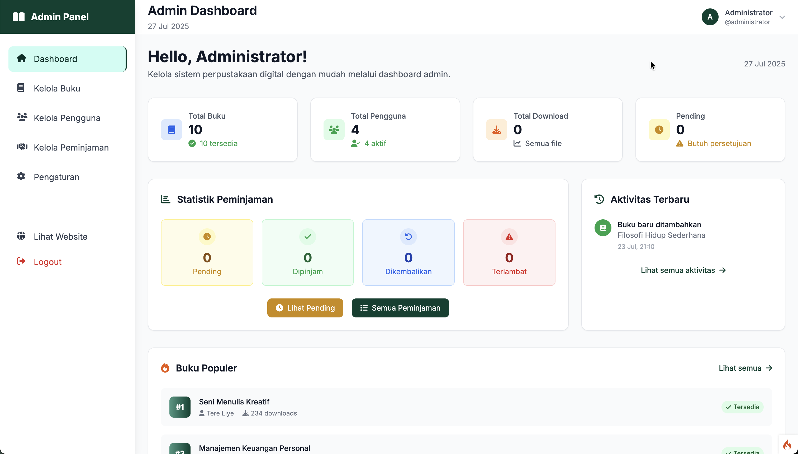
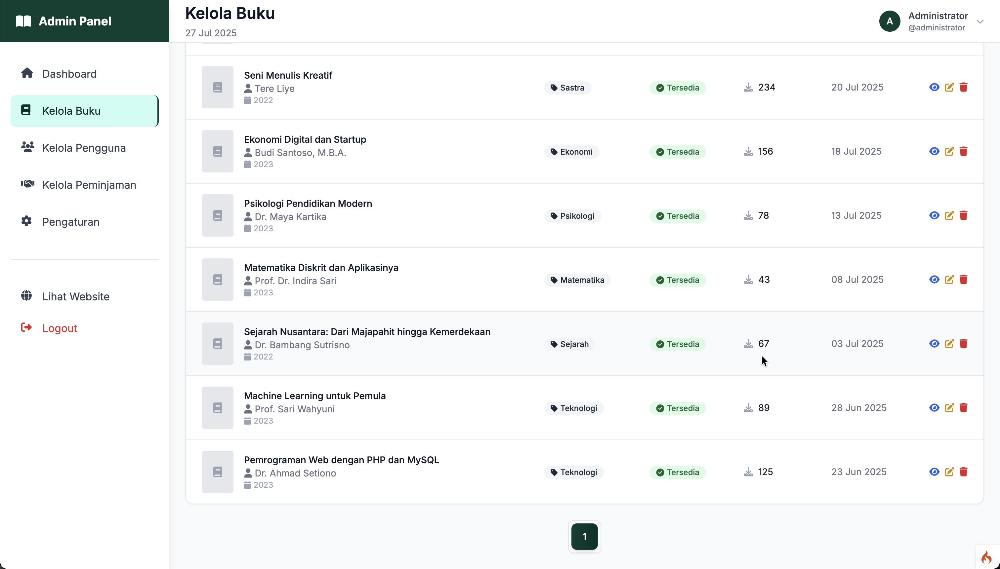
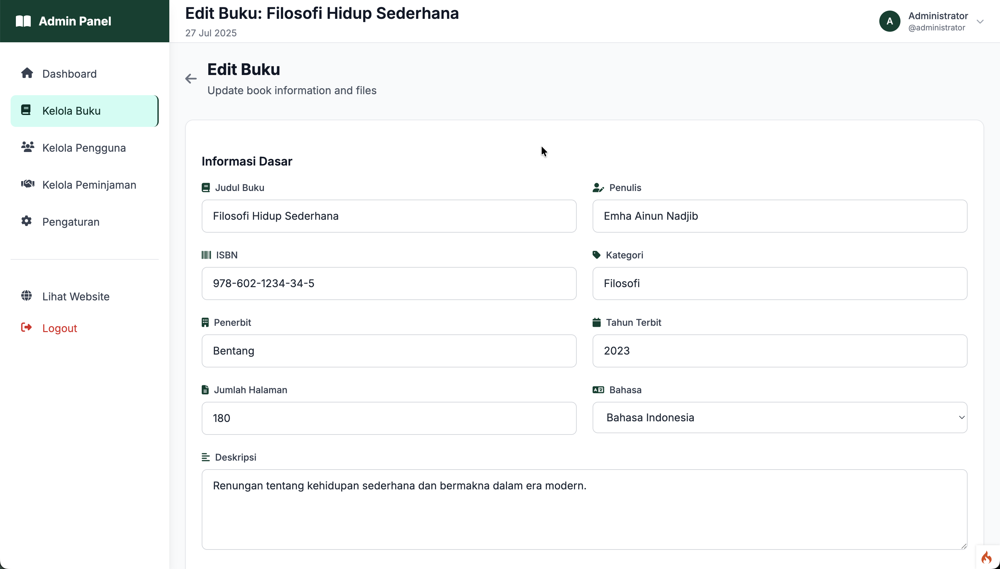
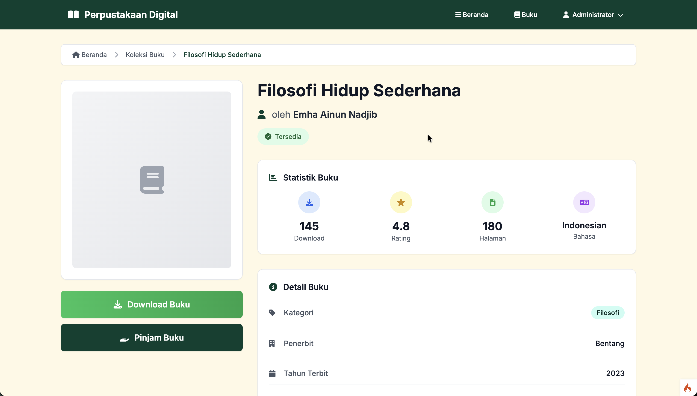
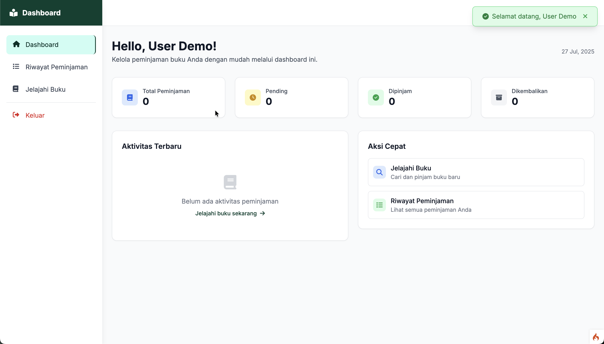

# Perpustakaan Digital

Sistem Perpustakaan Digital berbasis web menggunakan CodeIgniter 4 untuk manajemen koleksi buku digital dengan fitur peminjaman dan download.

## 📋 Daftar Isi

- [Fitur Utama](#fitur-utama)
- [Teknologi yang Digunakan](#teknologi-yang-digunakan)
- [Persyaratan Sistem](#persyaratan-sistem)
- [Instalasi](#instalasi)
- [Konfigurasi Database](#konfigurasi-database)
- [Konfigurasi Aplikasi](#konfigurasi-aplikasi)
- [Migrasi dan Seeder](#migrasi-dan-seeder)
- [Struktur Database](#struktur-database)
- [Akun Default](#akun-default)
- [Screenshot Tampilan](#screenshot-tampilan)
- [Panduan Penggunaan](#panduan-penggunaan)
- [Troubleshooting](#troubleshooting)

## ✨ Fitur Utama

- **Manajemen Buku Digital**
  - Upload buku dalam format PDF
  - Upload cover buku
  - Kategorisasi buku
  - Pencarian dan filter buku

- **Sistem Autentikasi**
  - Login/Register pengguna
  - Role-based access (Admin/User)
  - Session management

- **Manajemen Peminjaman**
  - Sistem peminjaman buku
  - Persetujuan peminjaman oleh admin
  - Tracking status peminjaman
  - Riwayat peminjaman

- **Download Buku**
  - Download file PDF buku
  - Tracking jumlah download
  - Log aktivitas download

- **Panel Admin**
  - Dashboard dengan statistik
  - Manajemen buku
  - Manajemen pengguna
  - Manajemen peminjaman
  - Pengaturan sistem

## 🛠 Teknologi yang Digunakan

- **Backend**: CodeIgniter 4
- **Database**: MySQL
- **Frontend**: HTML5, CSS3, JavaScript
- **CSS Framework**: Tailwind CSS
- **Icons**: Font Awesome 6
- **Fonts**: Google Fonts (Inter)
- **JavaScript Library**: Alpine.js

## 📋 Persyaratan Sistem

- PHP 7.4 atau lebih tinggi
- MySQL 5.7 atau lebih tinggi
- Apache/Nginx Web Server
- Composer
- Extension PHP yang diperlukan:
  - php-intl
  - php-json
  - php-curl
  - php-mysqlnd
  - php-gd (untuk upload gambar)

## 🚀 Instalasi

### 1. Clone Repository

```bash
git clone [repository-url]
cd uas-perpustakaan-digital
```

### 2. Install Dependencies

```bash
composer install
```

### 3. Setup Environment

```bash
# Copy file environment
cp env .env

# Edit file .env sesuai konfigurasi Anda
nano .env
```

### 4. Set Permissions

```bash
# Set permission untuk folder writable
chmod -R 755 writable/
chmod -R 755 public/uploads/
```

## 🗄 Konfigurasi Database

### 1. Buat Database MySQL

```sql
CREATE DATABASE perpustakaan_digital;
```

### 2. Konfigurasi Database di .env

```env
#--------------------------------------------------------------------
# DATABASE
#--------------------------------------------------------------------

database.default.hostname = localhost
database.default.database = perpustakaan_digital
database.default.username = [your_username]
database.default.password = [your_password]
database.default.DBDriver = MySQLi
database.default.DBPrefix =
database.default.port = 3306
```

## ⚙ Konfigurasi Aplikasi

### File .env - Konfigurasi Utama

```env
#--------------------------------------------------------------------
# ENVIRONMENT
#--------------------------------------------------------------------

CI_ENVIRONMENT = development

#--------------------------------------------------------------------
# APP
#--------------------------------------------------------------------

app.baseURL = 'http://localhost:8080/'
app.indexPage = ''
app.uriProtocol = 'REQUEST_URI'
app.defaultLocale = 'en'
app.negotiateLocale = false
app.supportedLocales = ['en']

#--------------------------------------------------------------------
# SECURITY
#--------------------------------------------------------------------

security.csrfProtection = 'cookie'
security.tokenRandomize = false
security.tokenName = 'csrf_token_name'
security.headerName = 'X-CSRF-TOKEN'
security.cookieName = 'csrf_cookie_name'
security.expires = 7200
security.regenerate = true
security.redirect = true

#--------------------------------------------------------------------
# SESSION
#--------------------------------------------------------------------

session.driver = 'files'
session.cookieName = 'ci_session'
session.expiration = 7200
session.savePath = null
session.matchIP = false
session.timeToUpdate = 300
session.regenerateDestroy = false
```

## 🔄 Migrasi dan Seeder

### 1. Jalankan Migrasi Database

```bash
# Jalankan semua migrasi
php spark migrate

# Atau jalankan manual jika diperlukan
php spark migrate:create create_books_table
php spark migrate:create create_users_table
php spark migrate:create create_loans_table
php spark migrate:create create_download_logs_table
php spark migrate:create create_settings_table
```

### 2. Jalankan Seeder (Data Dummy)

```bash
# Seed users
php spark db:seed UserSeeder

# Seed books
php spark db:seed BookSeeder
```

## 📊 Struktur Database

### Tabel `users`
```sql
CREATE TABLE `users` (
  `id` int(11) NOT NULL AUTO_INCREMENT,
  `name` varchar(255) NOT NULL,
  `email` varchar(255) NOT NULL UNIQUE,
  `password` varchar(255) NOT NULL,
  `role` enum('admin','user') DEFAULT 'user',
  `is_active` tinyint(1) DEFAULT 1,
  `created_at` datetime DEFAULT CURRENT_TIMESTAMP,
  `updated_at` datetime DEFAULT CURRENT_TIMESTAMP ON UPDATE CURRENT_TIMESTAMP,
  PRIMARY KEY (`id`)
);
```

### Tabel `books`
```sql
CREATE TABLE `books` (
  `id` int(11) NOT NULL AUTO_INCREMENT,
  `title` varchar(255) NOT NULL,
  `author` varchar(255) NOT NULL,
  `isbn` varchar(20) DEFAULT NULL,
  `category` varchar(100) DEFAULT NULL,
  `description` text,
  `file_path` varchar(255) DEFAULT NULL,
  `cover_image` varchar(255) DEFAULT NULL,
  `total_pages` int(11) DEFAULT NULL,
  `language` varchar(50) DEFAULT 'Indonesian',
  `status` enum('available','borrowed','maintenance') DEFAULT 'available',
  `download_count` int(11) DEFAULT 0,
  `rating` decimal(3,2) DEFAULT NULL,
  `created_at` datetime DEFAULT CURRENT_TIMESTAMP,
  `updated_at` datetime DEFAULT CURRENT_TIMESTAMP ON UPDATE CURRENT_TIMESTAMP,
  PRIMARY KEY (`id`)
);
```

### Tabel `loans`
```sql
CREATE TABLE `loans` (
  `id` int(11) NOT NULL AUTO_INCREMENT,
  `user_id` int(11) NOT NULL,
  `book_id` int(11) NOT NULL,
  `requested_start_date` date NOT NULL,
  `requested_end_date` date NOT NULL,
  `actual_start_date` date DEFAULT NULL,
  `actual_end_date` date DEFAULT NULL,
  `status` enum('pending','approved','rejected','returned') DEFAULT 'pending',
  `notes` text,
  `created_at` datetime DEFAULT CURRENT_TIMESTAMP,
  `updated_at` datetime DEFAULT CURRENT_TIMESTAMP ON UPDATE CURRENT_TIMESTAMP,
  PRIMARY KEY (`id`),
  FOREIGN KEY (`user_id`) REFERENCES `users`(`id`) ON DELETE CASCADE,
  FOREIGN KEY (`book_id`) REFERENCES `books`(`id`) ON DELETE CASCADE
);
```

### Tabel `download_logs`
```sql
CREATE TABLE `download_logs` (
  `id` int(11) NOT NULL AUTO_INCREMENT,
  `user_id` int(11) NOT NULL,
  `book_id` int(11) NOT NULL,
  `downloaded_at` datetime DEFAULT CURRENT_TIMESTAMP,
  PRIMARY KEY (`id`),
  FOREIGN KEY (`user_id`) REFERENCES `users`(`id`) ON DELETE CASCADE,
  FOREIGN KEY (`book_id`) REFERENCES `books`(`id`) ON DELETE CASCADE
);
```

### Tabel `settings`
```sql
CREATE TABLE `settings` (
  `id` int(11) NOT NULL AUTO_INCREMENT,
  `setting_key` varchar(255) NOT NULL UNIQUE,
  `setting_value` text,
  `description` text,
  `created_at` datetime DEFAULT CURRENT_TIMESTAMP,
  `updated_at` datetime DEFAULT CURRENT_TIMESTAMP ON UPDATE CURRENT_TIMESTAMP,
  PRIMARY KEY (`id`)
);
```

## 👤 Akun Default

Setelah menjalankan seeder, akun berikut akan tersedia:

### Admin
- **Email**: admin@perpustakaan.com
- **Password**: admin123
- **Role**: Administrator
- **Akses**: Full access ke semua fitur

### User Sample
- **Email**: budi@example.com
- **Password**: password
- **Role**: User
- **Akses**: Browse, download, dan peminjaman buku

## 📸 Screenshot Tampilan

### 1. Halaman Beranda


**Fitur yang ditampilkan:**
- Hero section dengan icon book reader
- Statistik perpustakaan (jumlah buku, pengguna, download)
- Daftar buku populer
- Daftar buku terbaru

### 2. Halaman Login


**Fitur yang ditampilkan:**
- Form login dengan email dan password
- Validasi input
- Link ke halaman register
- Responsive design

### 3. Halaman Register


**Fitur yang ditampilkan:**
- Form registrasi lengkap
- Validasi password confirmation
- Real-time validation feedback

### 4. Dashboard Admin


**Fitur yang ditampilkan:**
- Statistik lengkap perpustakaan
- Chart peminjaman bulanan
- Daftar buku populer
- Quick actions untuk manajemen

### 5. Manajemen Buku (Admin)


**Fitur yang ditampilkan:**
- Tabel daftar buku dengan pagination
- Filter dan pencarian
- Tombol aksi (edit, delete, view)
- Statistik download per buku

### 6. Form Tambah/Edit Buku


**Fitur yang ditampilkan:**
- Upload file PDF
- Upload cover image
- Form data lengkap buku
- Preview cover image

### 7. Halaman Detail Buku


**Fitur yang ditampilkan:**
- Informasi lengkap buku
- Tombol download (hijau, mudah terlihat)
- Tombol peminjaman
- Statistik buku (views, downloads)

### 8. Dashboard User


**Fitur yang ditampilkan:**
- Daftar peminjaman aktif
- Riwayat peminjaman
- Status peminjaman dengan warna-warna yang jelas

## 📖 Panduan Penggunaan

### Untuk Admin

1. **Login sebagai Admin**
   - Gunakan akun admin@perpustakaan.com
   - Akses menu "Admin Panel"

2. **Menambah Buku**
   - Masuk ke Admin → Books → New Book
   - Upload file PDF dan cover
   - Isi informasi lengkap buku
   - Save

3. **Manajemen Peminjaman**
   - Lihat daftar peminjaman di Admin → Loans
   - Approve/reject permintaan peminjaman
   - Track status peminjaman

### Untuk User

1. **Register/Login**
   - Buat akun baru atau login
   - Verifikasi email jika diperlukan

2. **Browse Buku**
   - Lihat koleksi di halaman Books
   - Gunakan filter dan pencarian
   - Klik buku untuk detail

3. **Download Buku**
   - Klik tombol hijau "Download"
   - File akan terdownload otomatis

4. **Peminjaman Buku**
   - Klik "Pinjam Buku" di detail buku
   - Pilih tanggal peminjaman
   - Tunggu persetujuan admin

## 🔧 Troubleshooting

### Problem: Error 500 saat akses
**Solusi:**
```bash
# Check permission
chmod -R 755 writable/
chmod -R 755 public/uploads/

# Check .env file
cp env .env
```

### Problem: Database connection error
**Solusi:**
- Periksa konfigurasi database di `.env`
- Pastikan MySQL service berjalan
- Cek username/password database

### Problem: Upload file gagal
**Solusi:**
```bash
# Set permission upload folder
chmod -R 755 public/uploads/

# Check php.ini settings
upload_max_filesize = 10M
post_max_size = 10M
```

### Problem: Session tidak berfungsi
**Solusi:**
```bash
# Clear session
rm -rf writable/session/*

# Check writable permission
chmod -R 755 writable/
```

## 📂 Struktur Folder Penting

```
uas-perpustakaan-digital/
├── app/
│   ├── Controllers/         # Logic aplikasi
│   ├── Models/             # Model database
│   ├── Views/              # Template tampilan
│   └── Database/
│       ├── Migrations/     # File migrasi
│       └── Seeds/          # Data dummy
├── public/
│   ├── uploads/
│   │   ├── books/          # File PDF buku
│   │   └── covers/         # Cover buku
│   └── index.php
├── writable/               # Cache, logs, session
└── .env                    # Konfigurasi aplikasi
```

## 📝 Catatan Pengembangan

- Gunakan environment `development` untuk debugging
- Backup database secara berkala
- Monitor log error di `writable/logs/`
- Update dependencies secara rutin dengan `composer update`

## 🤝 Kontribusi

Jika ingin berkontribusi:
1. Fork repository
2. Buat branch feature
3. Commit perubahan
4. Submit pull request

## 📄 Lisensi

Project ini menggunakan lisensi MIT. Lihat file LICENSE untuk detail lengkap.

## 👨‍💻 Informasi Pengembang

**Nama**: Akmal Fauzi  
**NIM**: 230401010160  
**Project**: UAS Perpustakaan Digital  

---

**Dibuat dengan ❤️ menggunakan CodeIgniter 4**
